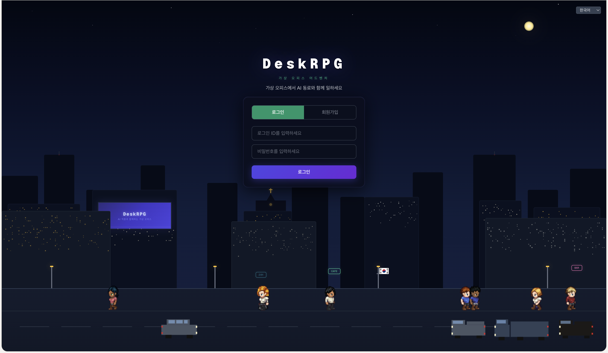

# DeskRPG

English README: [README.md](README.md)



[](https://www.hostinger.com/vps/docker-hosting?compose_url=https://raw.githubusercontent.com/dandacompany/deskrpg/refs/heads/master/docker-compose.yml)

오피스와 Hermes Agent를 VPS 한 대에서 24시간 돌리는 방법은 [deploy/hostinger](deploy/hostinger/README.md)를 보세요.

> ⚠️ **이어서 Traefik을 배포하세요.** 오피스의 HTTPS 주소는 Traefik이 만들어 줍니다. 이 배포가 끝나면 도커 매니저에 _"Traefik으로 Docker 프로젝트를 위한 HTTPS 활성화"_ 배너가 나타납니다. **Traefik 배포** 를 누른 뒤, DeskRPG 프로젝트 환경변수에 `TRAEFIK_HOST=srvNNNNNN.hstgr.cloud` 를 직접 추가하고 **저장 후 배포** 하세요. 자동으로 채워지지 않습니다. Hostinger에서 볼 수 있는 Traefik 두 가지 형태(호스트 모드, `traefik-proxy` 네트워크 방식) 모두 동작합니다.

VPS가 아직 없다면 [여기서 받으세요](https://hostinger.com/DANTE-DOCKER) (제휴 링크입니다 — 추가 비용 없이 이 프로젝트를 후원하게 됩니다). 받은 뒤 위 버튼을 누르면 됩니다.

DeskRPG는 직접 호스팅하는 **AI 에이전트용 3D 미니어처 가상 오피스**입니다. 이미 쓰고 있는 [Hermes Agent](https://github.com/NousResearch/hermes-agent) 프로필이 그대로 직원이 됩니다. 자리에 앉아 있다가 지명하면 답하고, 회의실에서 발언권을 주고받고, 칸반 카드를 처리합니다. **NPC를 곁으로 부르고 사무실 채팅에서 완료 보고를 확인하세요.** 여러 사람이 같은 오피스에 동시에 들어올 수 있습니다.

DeskRPG는 에이전트 런타임을 따로 담고 있지 않습니다. 이미 돌리고 있는 Hermes 게이트웨이에 붙기만 하므로, 기존 Hermes 사용자는 옮길 것 없이 프로필 그대로 올라탑니다.

- 웹사이트: [https://deskrpg.com](https://deskrpg.com) (운영 중)
- 소스 코드: `https://github.com/dandacompany/deskrpg`
- 버전: `v2026.921.3` — 회의가 끝나면 결정 사항과 후속 업무가 구조화되어 남고, 한 번 눌러 카드로 등록하면 직원이 시작하기 전에 승인을 기다립니다 — 새 판단 모음 화면이나 방 알림에서 바로 승인·반려·수정 요청을 합니다. 직원이 대화 중에 업무 카드를 제안할 수 있고(카드로 만들지는 사용자가 고릅니다), 직원 대화창에 미확인 배지가 붙는 카드 탭이 생겼으며, 보드에 칸반·목록과 나란히 실제 실행 기록을 보는 타임라인이 더해졌습니다. 이 기능들은 플러그인 0.11.1 이 필요합니다 — 게이트웨이 화면에서 갱신하세요. **2026.921.2 도커 이미지가 Linux 에서 받아지지 않던 문제를 고쳤습니다**(`max depth exceeded` — 이미지 레이어가 너무 많았습니다). 업데이트가 실패했다면 이 버전은 정상으로 설치됩니다. 그 밖에 밝은 테마에서 오류·성공 메시지가 읽히도록 색을 고쳤고, 이 README 의 도커 안내가 올바른 compose 파일을 가리키며, 갱신 안내가 색 없이 그려지던 문제를 고쳤습니다. 앞선 2026.921.2: 목록 보기, 직원이 걸어와 보고, 화면에서 플러그인 버전 확인·갱신.

## 무엇을 할 수 있나요

- 나와 모든 NPC의 외형을 50종의 스타일화된 오피스 룩(CC0 Quaternius 베이스를 완성형 인물로 재제작) 중에서 고릅니다. 룩 하나가 GLB 하나이고, 맵·출근부·회의실이 같은 모델을 씁니다.
- three.js로 그린 3D 오피스를 다섯 가지 환경(종합상사·에이전시·테크 스타트업·임원실·출판사)에서 걸어 다닙니다.
- Hermes 게이트웨이를 주소로 등록하거나, 설정 마법사로 로컬·SSH로 닿는 Hermes 설치를 찾아 플러그인을 점검하고 프로필을 등록합니다.
- Hermes 프로필에 묶인 AI NPC를 고용하고, `SOUL.md`를 웹에서 편집하고, NPC마다 모델·프로바이더·툴셋·추론 강도를 정합니다.
- 오피스 방에서 지명해 대화하고, NPC를 초대한 그룹 방을 열고, 응답의 전체 상태(대기 → 생각 중 → 스트리밍 → 완료·실패·취소)와 에이전트가 지금 쓰는 도구를 봅니다.
- 각 오피스 맵의 회의 공간으로 걸어 들어가 회의를 엽니다. 원래 맵과 캐릭터를 유지하면서 카메라를 가리는 벽을 투명화하고 발언자를 따라갑니다. 발언권 제어·거수·회의록 내보내기도 사용할 수 있습니다.
- Hermes가 관리하는 칸반 카드의 계획·실행·검토·완료를 확인합니다. NPC를 곁으로 부르고 사무실 채팅에서 카드 완료와 작업 차단 알림을 받습니다.
- NPC별 Hermes 크론 작업을 관리합니다. 블루프린트로 일정을 만들고, 일시정지·재개·즉시 실행·실행 기록 확인을 하며 결과를 사무실 채팅으로 받습니다.
- 다른 사람과 오피스를 공유합니다(멀티플레이어, 그룹, 역할 기반 권한). 한국어·영어·일본어·중국어를 지원합니다.

## 스크린샷

<table width="100%">
  <tr>
    <td width="50%" valign="top" align="center"><br /><strong>아침 출근길</strong></td>
    <td width="50%" valign="top" align="center"><br /><strong>호출하면 걸어와서 보고</strong></td>
  </tr>
  <tr>
    <td width="50%" valign="top" align="center"><br /><strong>실시간 스몰토크</strong></td>
    <td width="50%" valign="top" align="center"><br /><strong>에이전트 회의</strong></td>
  </tr>
</table>

## 빠른 시작

아래 다섯 가지 방법 중 하나를 골라 DeskRPG를 시작할 수 있습니다.

### 1. npm 설치 런타임

레포를 클론하지 않고 설치형 앱처럼 바로 쓰고 싶다면 이 방식이 가장 간단합니다.

**옛 릴리스 주의:** npm `2026.9.18`·`2026.9.19`는 `node_modules`에 설치하면 `Cannot find module '@/db'` 때문에 기동하지 못합니다. `2026.9.20` 이상을 쓰세요 — 릴리스 파이프라인이 레지스트리에서 설치한 패키지를 직접 기동해 확인합니다.

```bash
npx deskrpg init
npx deskrpg start
```

DeskRPG의 가변 런타임 데이터는 `~/.deskrpg/` 아래에 저장됩니다.

- `~/.deskrpg/.env.local`
- `~/.deskrpg/data/deskrpg.db`
- `~/.deskrpg/uploads/`
- `~/.deskrpg/logs/`

브라우저에서 `http://localhost:3000`을 엽니다.

퍼블리시된 npm 패키지 이름은 `deskrpg`입니다.

### 2. 로컬 실행 + PostgreSQL

```bash
git clone https://github.com/dandacompany/deskrpg.git
cd deskrpg
npm install
cp .env.example .env.local
npm run setup
npm run dev
```

브라우저에서 `http://localhost:3000`을 엽니다.

레포에서 전체 기능을 가장 직접적으로 확인하려면 이 방식이 가장 좋습니다.

### 3. 로컬 실행 + SQLite

```bash
git clone https://github.com/dandacompany/deskrpg.git
cd deskrpg
npm install
npm run setup:lite
npm run dev
```

SQLite 데이터는 `data/deskrpg.db`에 저장됩니다.

### 4. Docker + PostgreSQL

여러 사용자가 함께 쓰거나, 조금 더 안정적인 데이터 저장이 필요하면 이 구성을 권장합니다.

```bash
git clone https://github.com/dandacompany/deskrpg.git
cd deskrpg
printf 'JWT_SECRET=%s\nPOSTGRES_PASSWORD=%s\n' "$(openssl rand -hex 32)" "$(openssl rand -hex 16)" > .env.docker
docker compose --env-file .env.docker -f docker/docker-compose.external.yml up -d
```

DeskRPG는 `http://localhost:3102`에서 열립니다.

`down`·`logs`를 포함해 매번 `-f docker/docker-compose.external.yml`을 붙이세요. 저장소 루트에도
`docker-compose.yml`이 있지만 그것은 Hostinger 원클릭 스택입니다 — HTTP 포트를 열지 않고
`COOKIE_SECURE` 기본값이 `true`라, 그냥 `docker compose up`을 하면 접속할 포트가 없고 HTTP에서는
브라우저가 로그인 쿠키를 버립니다. 그 경로는 [deploy/hostinger/README.md](deploy/hostinger/README.md)를 보세요.

공개 이미지는 GHCR `ghcr.io/dandacompany/deskrpg`에 있습니다. Compose 기본값은 `ghcr.io/dandacompany/deskrpg:latest`이며, 특정 릴리스로 고정하려면 `.env.docker`에 `DESKRPG_IMAGE=ghcr.io/dandacompany/deskrpg:<릴리스 태그>`를 설정하세요. 옛 Docker Hub `dandacompany/deskrpg` 이미지는 `2026.9.19`에서 멈춘 레거시이며 새 릴리스가 올라가지 않습니다.

### 5. Docker + SQLite

한 대의 서버에서 가볍게 시작하고 싶다면 이 구성이 가장 간단합니다.

```bash
git clone https://github.com/dandacompany/deskrpg.git
cd deskrpg
printf 'JWT_SECRET=%s\n' "$(openssl rand -hex 32)" > .env.lite
docker compose --env-file .env.lite -f docker/docker-compose.lite.yml up -d
```

DeskRPG는 `http://localhost:3102`에서 열립니다.

특정 릴리스로 고정하려면 명령 앞에 `DESKRPG_IMAGE=ghcr.io/dandacompany/deskrpg:<릴리스 태그>`를 붙이면 됩니다([릴리스 태그 목록](https://github.com/dandacompany/deskrpg/releases)).

빠르게 시작하려면 SQLite, 오래 운영하려면 PostgreSQL을 선택하면 됩니다.

### 환경 변수

중요한 환경 변수:

- `JWT_SECRET`
- `POSTGRES_PASSWORD` (PostgreSQL Docker 구성 사용 시)
- `DESKRPG_LOCAL_DISCOVERY_ENABLED` (선택 사항. 루프백 게이트웨이가 호스트의 `~/.hermes/profiles`를 읽도록 허용합니다. 기본값은 꺼짐)
- `DESKRPG_HOST_SETUP_ENABLED` (선택 사항. 로컬·SSH 게이트웨이 설정 마법사는 `system_admin` 에게 기본으로 열립니다. 끄려면 `0`)
- `DESKRPG_FEEDBACK_URL` (선택. 설문과 비공개 버그 리포트를 받을 주소 — [DeskRPG가 보내는 데이터](#deskrpg가-보내는-데이터) 참고. 빈 값이면 둘 다 꺼집니다)

운영 환경에서는 반드시 실제 `JWT_SECRET` 값을 설정해야 합니다.

게이트웨이 URL과 토큰은 환경 변수가 아닙니다. 앱의 `내 게이트웨이` 페이지에서 등록한 뒤,
`설정 -> 채널 설정 -> AI 연결`에서 채널에 연결합니다.

## Hermes 연결

AI NPC, 태스크 자동화, AI 회의는 모두 Hermes 게이트웨이를 통해 동작합니다.

DeskRPG는 에이전트 런타임을 함께 배포하지 않습니다.
[Hermes Agent](https://github.com/NousResearch/hermes-agent) API 서버를 직접 띄우세요.
같은 머신이든 접근 가능한 다른 호스트든 상관없습니다. Hermes 쪽에서 두 가지를 확인해 둡니다.

- API 서버가 열려 있는 주소 (예: `http://127.0.0.1:8642`)
- **리스너 소유자 키** — 리스너를 소유한 프로필의 `API_SERVER_KEY`

Hermes는 설정이 머신 단위인 반면 인증은 프로필 단위입니다. 프로필마다 키가 따로 있습니다.
DeskRPG에는 보조 프로필의 키가 아니라 **소유자 키**를 주세요. 칸반·크론·사건 스트림은
프리픽스 없는 경로에 있고, Hermes는 그 경로를 소유자 키로만 인증합니다. 보조 프로필의 키로도
대화는 되지만 보드와 일정은 전부 `plugin_unauthorized` 로 막히고 화면은 이유를 알려주지 않습니다.

DeskRPG에 연결하는 절차는 네 단계입니다.

**1. 게이트웨이 등록**

우측 상단 메뉴에서 `내 게이트웨이`를 열고 `새 게이트웨이`를 선택합니다.

- `표시 이름` — 나중에 알아볼 수 있는 이름이면 됩니다
- `Hermes 게이트웨이 URL` — 예: `http://127.0.0.1:8642`
- `토큰` — 해당 게이트웨이의 리스너 소유자 키(`API_SERVER_KEY`)

저장한 뒤 연결 테스트를 실행합니다. 실패하면 그냥 실패로 끝나지 않고 원인을 알려주므로,
설정을 바꾸기 전에 메시지를 먼저 읽어 보세요.

**2. Hermes 프로필 추가**

하나의 게이트웨이가 여러 에이전트 프로필을 서빙할 수 있고, 프로필마다 키가 다릅니다.
같은 페이지에서 추가합니다. NPC가 실제로 바인딩되는 대상은 프로필이므로, 게이트웨이만
등록해 두면 아직 부족합니다.

**3. 채널에 게이트웨이 연결**

채널에 입장한 뒤 `설정 -> 채널 설정 -> AI 연결`에서 저장해 둔 게이트웨이를 고르고,
테스트한 다음 저장합니다. 적용되면 헤더 배지가 `AI 연결`로 바뀝니다.

**4. 칸반·크론을 쓰려면 플러그인 설치**

대화는 플러그인 없이도 됩니다. 칸반 보드와 사건 스트림, 크론은 게이트웨이 호스트에
[`deskrpg-hermes-plugin`](https://github.com/dandacompany/deskrpg-hermes-plugin) 이 필요합니다.

```bash
hermes plugins install https://github.com/dandacompany/deskrpg-hermes-plugin
hermes plugins enable deskrpg
# 게이트웨이 재시작 — 라우트는 기동할 때만 붙습니다
```

`enable` 은 선택이 아닙니다. 설치만 하고 건너뛰면 모든 플러그인 라우트가 404를 냅니다.
DeskRPG는 플러그인이 없거나 낡았다고 판단하면 보드·일정 화면에 같은 명령을 그대로 보여줍니다.

이제 NPC를 고용할 수 있습니다. NPC는 고용 시점에 Hermes 프로필 하나에 바인딩되며,
해고하지 않고 나중에 다른 프로필로 다시 연결할 수 있습니다.

## DeskRPG는 어떻게 동작하나요

### 1. 캐릭터

- 모든 사용자는 3D 캐릭터로 채널에 입장합니다.
- 맵·출근부·회의실에서 함께 쓰는 완성형 GLB 오피스 룩 50종 중 하나를 고릅니다.
- 채널에 들어가기 전에 캐릭터를 먼저 만들어야 합니다.

### 2. 채널

- 채널은 공유 오피스 공간입니다.
- 공개/비공개 여부와 그룹 규칙에 따라 접근 방식이 달라질 수 있습니다.
- 채널 맵은 맵 템플릿을 기반으로 생성됩니다.

### 3. AI NPC

- NPC는 채널 안에서 함께 생활합니다.
- NPC는 Hermes 프로필 하나에 바인딩되며, 해고하지 않고 다시 연결할 수 있습니다.
- NPC와의 1:1 대화는 캐릭터별로 저장되어 서버를 재시작해도 남습니다.
- 앱 안의 메뉴에서 호출, 복귀, 대화, 수정, 대화 초기화, 해고가 가능합니다.

### 4. 칸반과 보고

- 채널의 Hermes 프로필에 칸반 카드를 배정합니다. 카드와 실행 상태는 Hermes가 관리합니다.
- 계획·실행·차단·검토·완료까지 카드의 진행을 확인합니다.
- 최상위 카드 완료와 카드 차단 알림이 사무실 채팅에 표시되며, 알림에서 카드를 열 수 있습니다.
- NPC 메뉴로 곁에 호출해 캐릭터 옆에서 업무를 이야기할 수 있습니다.

### 5. 회의

- 모든 오피스 맵에 회의 공간이 있습니다. 회의 모드는 별도 회의실을 불러오지 않고 현재 맵의 회의 공간을 화면 전체로 확대·고정합니다.
- 카메라와 참여자 사이의 벽은 투명해지고, 카메라가 현재 발언자를 자동으로 따라가며 수동 회전도 유지됩니다.
- AI 회의는 채널 단위로 동작하며, 해당 채널의 Hermes 게이트웨이가 오케스트레이션합니다.
- 저장된 회의록은 헤더에서 바로 확인할 수 있습니다.

### 6. 일정

- 일정 사본을 DeskRPG에 만들지 않고 NPC별 Hermes 크론 작업을 생성·관리합니다.
- 작업을 일시정지·재개하거나 즉시 실행하고, 최근 실행 기록을 확인하고, 블루프린트로 자주 쓰는 일정을 만듭니다.
- 실행이 끝나면 구조화된 결과가 해당 일정을 만든 오피스 방에 게시됩니다.

## DeskRPG가 보내는 데이터

오피스·직원·대화에 관한 정보는 보내지 않습니다. 브라우저 밖으로 나갈 수 있는 것은 아래 두 가지뿐이고, 둘 다 선택입니다.

- **사용 경험 설문.** 맵 화면을 약 30분 쓰면 짧은 설문이 뜹니다(최대 30일에 한 번). **보내기**를 누르기 전에는 아무것도 전송되지 않고, **다시 묻지 않기**를 누르면 그 브라우저에서는 다시 뜨지 않습니다. 응답에는 답변, 앱 버전, 화면 언어, 중복 응답을 가리는 데만 쓰는 무작위 설치 ID 가 담깁니다.
- **비공개 버그 리포트.** **메뉴 → 버그 신고**에서 공개 GitHub 이슈와 비공개 전송 중 고를 수 있습니다. 비공개 전송에는 입력한 내용, 선택 연락처, 버전·브라우저·화면 크기·최근 오류가 담기며, 보내기 전에 모두 보여 주고 항목별로 뺄 수 있습니다.

설문 시기가 되면, 답하기 전에 브라우저가 같은 서버에서 설문 문항을 먼저 받아 옵니다(`GET /v1/survey`). 이 요청에는 식별자가 없지만 사용자의 IP 로 서버에 닿습니다.

둘 다 DeskRPG 관리자가 운영하는 `https://feedback.deskrpg.com` 으로 갑니다. 서버는 요청 수 제한을 위해 솔트를 섞은 IP 해시만 남기고 IP 자체는 저장하지 않습니다. 서버에 `DESKRPG_FEEDBACK_URL=`(빈 값)을 두면 둘 다 꺼지고, 직접 운영하는 수집 서버 주소로 바꿀 수도 있습니다.

새 버전 표시를 위해 맵 화면이 DeskRPG 서버를 거쳐 GitHub API 에 Star 수와 최신 릴리스를 묻습니다. 식별자는 보내지 않습니다.

## 제품 메모

- 초대 코드가 있어도 로그인은 필요합니다.
- 초대 코드는 채널 접근을 돕는 수단이지, 익명 접근 토큰은 아닙니다.
- 오피스 배치는 코드로 조립하고, 실제 three.js 렌더러는 버전이 고정된 GLB 가구·건축·캐릭터 모델과 제작된 PBR 표면 텍스처를 사용합니다.

## 라이선스와 크레딧

- 프로젝트 라이선스: [LICENSE.md](LICENSE.md)
- 서드파티 라이선스: [public/third-party-licenses.html](public/third-party-licenses.html)

## 문의

- YouTube: [@dante-labs](https://youtube.com/@dante-labs)
- 이메일: `dante@dante-labs.com`
- Buy Me a Coffee: `https://buymeacoffee.com/dante.labs`
